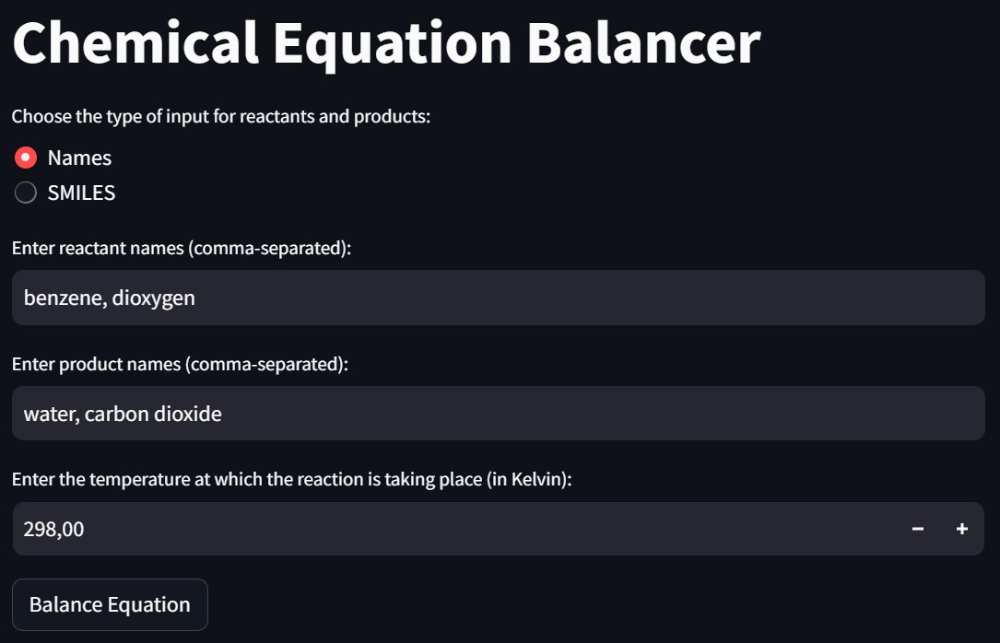
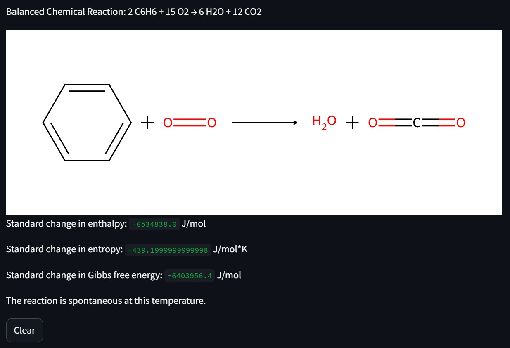

## Introduction:
The Chemical Equation Balancer is a Python-based package designed to balance and equilibrate chemical equations. It also gives crucial thermodynamics information on the reaction. This is designed to be adapted for everyone from beginers to advanced chemists. It uses Streamlit interface which is easily used for a more welcoming interraction and quick understanding. 

## How it works: 
It accepts reactants and products either as SMILES strings or chemical compound names and performs stoichiometric calculations to balance the equation. 
Additionally, it calculates thermodynamic properties such as standard enthalpy, entropy, and Gibbs free energy to provide insights into the spontaneity of the reaction.

## Motivations:
Balancing chemical equations is a fundamental task in chemistry, crucial for understanding reaction stoichiometry and predicting reaction outcomes. However, manually balancing complex equations can be time-consuming and error-prone. This tool aims to automate the balancing process, making it more efficient and accurate. Furthermore, by providing thermodynamic properties, it enhances the understanding of the underlying energetics of chemical reactions.
A real-life use would be to help first-year EPFL students in ERC (equilibrium for chemical reactions) which have to do enthalpy and enthropy calculations all day long. 

## Description:
The Chemical Equation Balancer is built using Python and leverages various libraries for cheminformatics, linear programming, and thermodynamic calculations. Key libraries include RDKit for molecular structure manipulation, PuLP for solving integer linear programming problems, and chemicals for retrieving chemical properties. The tool is deployed as a web application using Streamlit, allowing users to input reactants and products interactively.

Upon inputting reactants and products, the tool automatically balances the chemical equation using integer linear programming. It then displays the balanced equation in a human-readable format and visualizes it using SVG images. Additionally, it calculates standard enthalpy, entropy, and Gibbs free energy based on the provided temperature, offering insights into the thermodynamics of the reaction.

The special description of each function used to get the outcomes is available in notebook.ipynb
The one of the function used for the interface is available in ChemBalencer_interface.ipynb

## Example of usage 

An example is displayed here, the user chose to input chemical names for the combustion reaction of benzene at 298.00 K :

This is the result he got.

 
He we can choose to clear everything or to do the same thing for a new equation. 

## Challenges faced

During the whole project we faced many challenges. From the start with the decision on how to design the interaction with the users. This led to the actual setting where the user can choose what to input for its reaction. 
The balance of the equation was less of a struggle as it really used skills we developped during the semester and last year. The next challege was the represenation of the reaction which was very time-consuming. In the end the vsg was a great compromise as is it easy to understand while keeping the major part of informations on the compounds structure and chemical reaction. 
In the end, the biggest challenge was the organization of the python package with all the constrincts and requierments that it goes with (tests, notebook...)

## Conclusion:

The Chemical Equation Balancer offers a convenient and efficient solution for balancing chemical equations, having a visual representation of them and analyzing reaction thermodynamics. By automating the balancing process and providing thermodynamic insights, it streamlines chemical analysis tasks and aids in the understanding of reaction kinetics and energetics. This tool serves as a valuable resource for students, researchers, and professionals working in the field of chemistry. 
